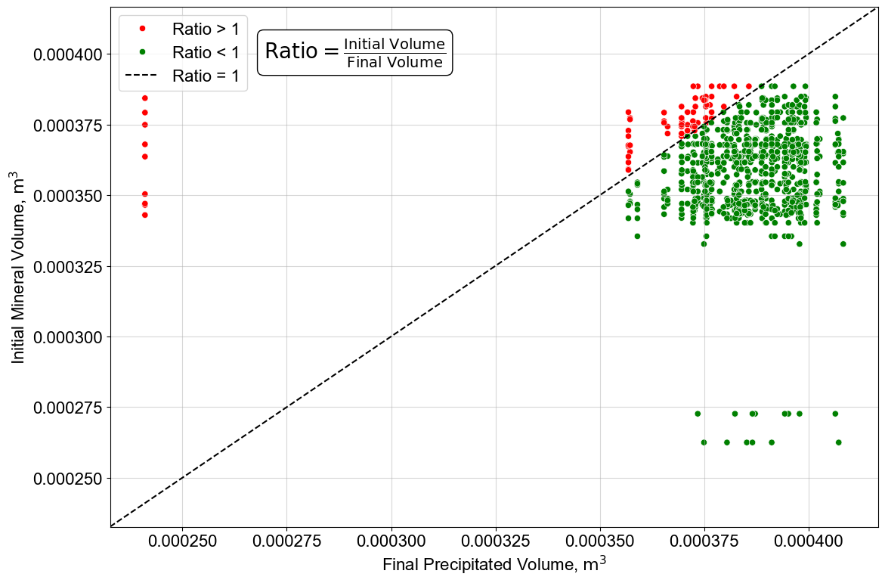
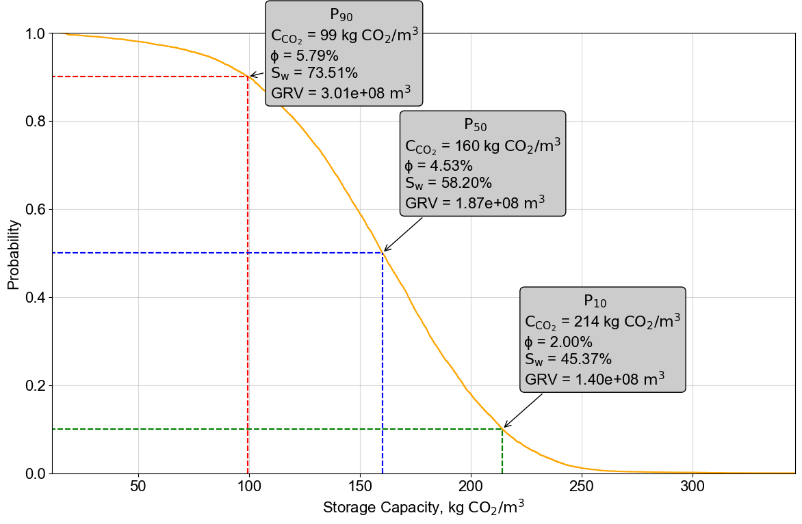

# IFPmin CO2 Storage & Injectivity Analysis

Welcome! This repository contains Python classes and methods for modeling CO₂ storage in rock formations, generating simulation input data, and analyzing injectivity in a reservoir setting. The main classes are:

1. **IFPMin**:  
   - Base class to generate simulation files and process mineralization data.  
   - Calculates CO₂ storage capacities based on mineral precipitation.

2. **GasProperties (extends IFPMin)**:  
   - Provides PVT calculations (density, viscosity, Z-factor) for CO₂ using CoolProp.

3. **IFlowP (extends GasProperties)**:  
   - Adds methods for gas injectivity calculations with real-gas pseudo-pressures.

---

## Table of Contents

1. [Features](#features)  
2. [Installation](#installation)  
3. [Usage Examples](#usage-examples)  
   1. [1. Generating Simulation Files](#1-generating-simulation-files)  
   2. [2. Processing Simulation Data](#2-processing-simulation-data)  
   3. [3. Plotting a Ratio Comparison](#3-plotting-a-ratio-comparison)  
   4. [4. Monte Carlo Storage Analysis](#4-monte-carlo-storage-analysis)  
   5. [5. Injectivity Calculation](#5-injectivity-calculation)  
4. [Dependencies](#dependencies)  
5. [License](#license)

---

## Features

- **Generate .inn Simulation Files**: Easily create multiple ArXim simulation input files from a mineral composition dataset.  
- **Process Simulation Results**:  
  - Compute volumes, CO₂ mass, storage capacity, and saturations (porosity, Sw).  
  - Combine random sampling of input data with precipitation results.  
- **Plotting Tools**:  
  - Compare final vs. initial rock volumes in a 2D scatter with a 45° reference line.  
  - Generate an ECDF plot for storage capacity (P10, P50, P90).  
- **CO₂ PVT**: High-accuracy fluid properties via CoolProp (density, viscosity, Z-factor).  
- **Injectivity Analysis**: Compute injection rates & indexes with a real-gas pseudo-pressure approach, including non-Darcy effects.  

---

## Installation

1. Clone the repository:
   ```bash
   git clone https://github.com/guneltugberk/IFPMin.git
   ```
2. Change into the directory and install the requirements:
   ```bash
   cd CO2-Storage-Analysis
   pip install -r requirements.txt
   ```
   Make sure you have a recent version of Python (3.8+ recommended).

---

## Usage Examples

### 1. Generating Simulation Files

```python
import pandas as pd
from your_module import IFPMin

# Suppose you have a DataFrame of mineral compositions:
input_data = pd.DataFrame({
    "AMORPH-SILICA": [10, 12, 9],
    "CORUNDUM": [5, 4, 6],
    "FERROUS-OXIDE": [3, 3, 3],
    "HEMATITE": [2, 2, 2],
    "MANGANOSITE": [1, 1, 1],
    "PERICLASE": [0.5, 0.5, 0.5],
    "LIME": [0.5, 0.4, 0.6],
    "SODIUM-OXIDE": [0.3, 0.3, 0.3],
    "POTASSIUM-OXIDE": [0.2, 0.1, 0.2]
})
simulation_result = pd.DataFrame(...)  # e.g., from existing data or placeholders

# Create an instance
ifp = IFPMin(input_data=input_data, simulation_result=simulation_result)

# Generate 5 simulation files in directory "Simulation"
output_dir = ifp.generate_simulation_files(output_dir="Simulation", num_simulation=5)
print(f"Simulation files are saved at: {output_dir}")
```

---

### 2. Processing Simulation Data

```python
# Continue from the IFPMin instance above
processed_results, random_generation = ifp.process_simulation_data(
    random_size=100, 
    output_dir="Simulation",
    file_name="RandomSamples"
)

print("Processed Simulation Results:\n", processed_results.head())
```

What happens here:
- Random samples are drawn from `input_data`.
- Mineral volumes are calculated and appended to `simulation_result`.
- CO₂ mass (`kg CO2`) and storage capacity (`kg CO2/m3`) are computed.
- Water saturation and porosity are randomly assigned using log-normal distributions.

---

### 3. Plotting a Ratio Comparison

```python
# Assuming 'processed_results' has columns like 'Volume Rock, m3' & 'Final Volume Rock, m3'
ifp.plot_ratio_comparison(output_dir="Simulation")
```

This creates a scatter plot comparing the initial vs. final volumes, saved as **`ratio.png`**. An example figure might look like this:



---

### 4. Monte Carlo Storage Analysis

```python
# Run a Monte Carlo analysis on storage capacity
ifp.MonteCarloStorage(num_simulations=10000, output_dir="Simulation")
```

This method:
- Draws random sets of CO₂ mass, rock volumes, porosity, and water saturations.
- Computes an ECDF of the resulting storage capacities.
- Marks key probabilities (P10, P50, P90) on the plot.
  
Example output figure:



---

### 5. Injectivity Calculation

For injectivity-related calculations, use the `IFlowP` class. It extends `GasProperties` (and thus `IFPMin`) and includes real-gas pseudo-pressure and non-Darcy flow terms:

```python
from your_module import IFlowP

inject = IFlowP(
    pressure=250,     # bar
    temperature=40,   # °C
    porosity=0.05,    # 5%
    Pinj=270,         # Injection pressure (psia or bar, depending on how you're defining units)
    target=1e6        # Storage objective in tonnes of CO2
)

result = inject.co2_injectivity(k=3, h=600, rw=0.15, skin=0)
```

Upon execution, you may see a result table such as:

```
=======================================================================================
|                              CO2 Analytical Simulation                              |
=======================================================================================
|                                       Results                                       |
=======================================================================================
|   Parameter                               Value                             Units   |
---------------------------------------------------------------------------------------
|   Mechanical Skin                          0.00                     Dimensionless   |
|   Rate Dependent Skin                      1.88                     Dimensionless   |
|   Effective Skin                           1.88                     Dimensionless   |
|   Injectivity Index                        3.25           tonnes CO₂/bar².cp.year   |
|   Target Storage                       1.00e+06                        tonnes CO₂   |
|   Number of Wells                          2.00                            -        |
=======================================================================================
```

Where:
- **Mechanical Skin** is your input (e.g., 0.0).  
- **Rate Dependent Skin** accounts for non-Darcy effects.  
- **Effective Skin** is the sum of mechanical skin and rate-dependent skin.  
- **Injectivity Index** is given in units of `tonnes CO2/bar²·year`.
- **Target Storage** is the objective of storage in tonnes of CO2.
- **Number of Wells** is the estimated approximate required number of wells.

---

## Dependencies

- [Python 3.8+](https://www.python.org/downloads/)
- [NumPy](https://numpy.org/)
- [Pandas](https://pandas.pydata.org/)
- [Matplotlib](https://matplotlib.org/)
- [Seaborn](https://seaborn.pydata.org/)
- [CoolProp](https://github.com/CoolProp/CoolProp)
- [SciPy](https://scipy.org/)
- [Openpyxl or XlsxWriter] (for Excel output, if required)

Install them via:

```bash
pip install numpy pandas matplotlib seaborn CoolProp scipy openpyxl
```

---

## License

This project is licensed under the [MIT License](LICENSE).  

Feel free to modify or extend to suit your specific requirements. If you use or reference this code in your work, a citation or link back to this repository is appreciated!
